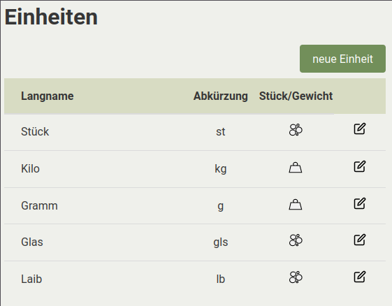
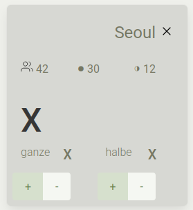

# Benutzung


## Erste Einrichtung

Nach [der Installation](./Installation.md) der Möhrenschleuder kann das Tool zbsp unter `localhost:8000` oder jedweder Domain die bei der Installation eingerichtet wurde aufgerufen werden.

Es muss der `Name` des Betriebes eingegeben werden und es kann eine Fußzeile für die Lieferscheine angegeben werden.
Diese Optionen sind danach änderbar.


Richte nun nötige Einheiten ein auf der Einstellungsseite, mehr infos unten im Fahrplan.

## Fahrplan

### Einheiten



In den `Einstellungen` können Einheiten angelegt werden. Einheiten haben einen **Namen**, **Kurznamen** und einen **Einheitentyp**.

Zum Beispiel:

```
Name: "Kilogramm", Kurzname: "Kg", Einheitentyp: Gewicht
Name: "Stück", Kurzname: "St", Einheitentyp: Stück
```

Du kannst alle notwendigen Einheiten jederzeit, auch später in laufender Verteilung, anlegen. Du solltest damit möglichst beginnen (ein Produkt ohne Einheiten anlegen macht nicht so viel Sinn).
 Einheiten können auch geändert werden, das kann allerdings die Statistiken gut zerschiessen.

:warning:
>  **Wichtig**: Beim Verteilen von Erzeugnissen die bei Abnehmer:Innen eher im Grammbereich ankommen sollte eine Einheit wie zbsp Gramm eingetragen werden und das Erzeugniss dann eher in `50000 g` als in `50kg` verteilt werden! Der grund dafür sind Rundungsfehler die sich bei einer Verteilung im tiefen Kommabereich sonst einstellen würden.


### Stationen

In der Stationsübersicht kannst du Stationen hinzufügen, ändern und löschen.


Stationen haben einen **Namen**, **Ganze** Anteile, **Halbe** Anteile, eine **Reihenfolge** und ein **Infofeld**.


Das **Infofeld** ist nur Intern für nützliche Infos für die Nutzer:Innen.
Die **Reihenfolge** bestimmt wie die Stationen in der Übersicht und der Verteilung angezeigt werden.
**Ganze** und **Halbe** Anteile sind natürlich für die Berechnung später wichtig.

Die Stationen **müssen** vor der Verteilung alle korrekt eingetragen sein.

Zum Beispiel:

 * **Name**: Südost
 * **Ganze**: 12
 * **Halbe**: 8
 * **Reihenfolge**: 1
 * **Infofeld**: Gemüsestraße 15, 12345 Stadt, bei "Lecker" klingeln


### Produkte

In der Produktübersicht können Erzeugnisse hinzugefügt, geändert und gelöscht werden.


Ein Produkt hat einen **Namen**, ein oder mehrere **Einheiten** und **Infofeld**.
Das **Infofeld** ist nur Intern für nützliche Infos für die Nutzer:Innen.

Zum Beispiel:

 * **Name**: Rote Beete
 * **Einheiten**: Kilogramm, Stück
 * **Infofeld**: Manchmal als Stück rausgegeben

Ausserdem wird die Liste danach *sortiert wann ein Erzeugniss dass letzte mal verteilt* wurde. Es kann auch selber sortiert und gesucht werden. Für statistische Zwecke ist sehr zu empfehlen ein Produkt nicht doppelt einzutragen sondern kurz zu suchen ob es schon vorhanden ist und gegebenfalls eine Einheit mehr einzutragen.


Beim Klick auf ein Produkt gelangt man in die Verteilungsansicht falls die Verteilung schon gestartet wurde


### Verteilung

Das ist das komplexeste und gleichzeitig die Herzstückseite des Tools.
Wenn die Verteilung gestartet wurde (siehe unten) kann mit einem Klick auf ein Erzeugniss in der Produktübersicht die Verteilung dieses Erzeugnisses losgehen.

 - **Falls ein Produkt mehrere Einheiten hat** wird man gefragt welches man Verteilen möchte. Es ist auch möglich ein Produkt mit all seinen Einheiten zu verteilen. 
 - **Falls ein Produkt in Einheitentyp** `Stück` verteilt wird erscheinen `+` und `-` Knöpfe zum einfachen hinzufügen oder wegnehmen von anteilen pro station und jeweils für halbe und ganze anteile. Es wird auch ein `Rest` angezeigt und es gibt auch einen Hinweis pro Station wieviel Mitglieder dort sind um die Verteilung einfacher zu gestalten. 
 - **Falls ein Produkt schon verteilt wurde** wird man auf der "Verteilseite" darauf hingewiesen und hat nun die Möglichkeit das Produkt zusätzlich zu verteilen oder zu überschreiben.
	
	  - Zusätzlich: Verteile das Erzeugniss zusätzlich, wird automatisch zu den bisherigen Werten addiert.
	  - Überschreiben: Verteile das Erzeugniss erneut.

Auf der Verteilseite **muss die Menge des Erzeugniss angegeben werden**.

Es können vereinzelte Stationen *abgewählt* werden mit Klick auf ihren Namen.


Verteilung wird berechnet mit Klick auf einen der Knöpfe:
 
 * gleich: alle Anteile kriegen gleich viel
 * halbe halb: halbe Anteile kriegen halb so viel
 * halbe nix: halbe Anteile kriegen offensichtlich nix

Wenn du zufrieden mit der Verteilung bist kannst du mit klick auf `Speichern` das ganze so wie du es siehst abspeichern. Die Seite bleibt so bis du wegklickst. Solltest du danach allerdings etwas ändern überschreibst du mit erneutem `Speichern` natürlich wieder das abgespeicherte.

:warning:
> Die Verteilung funktioniert ist jedoch gerade der wackeligste Teil der Anwendung! Ich werde mir mühe geben nach anständigem Erlernen von Javascript und DOM-Beherrschung eine bessere Nutzererfahrung zu programmieren- das wird spätestens April 2023 der Fall sein.


#### Starten

Mit klick auf `Verteilung starten` rechts im Menu kann man die Verteilung starten.


#### Während der Verteilung

Es gibt während der Verteilung unter `Übersicht` eine Übersicht und im Menu rechts stehen die schon Verteilten Erzeugnisse. Durch klick darauf erscheinen wieder Details darüber wie an welche Station verteilt wurde.


##### Abbrechen

Die Verteilung kann auch abgebrochen werden in der `Übersicht`. Dazu muss in der `Übersicht` auf `Verteilung stoppen` geklickt werden

##### Infos für Lieferscheine

Es kann in der `Übersicht` auch Infos hinzugefügt werden. Es gibt dazu für jedes Produkt ein Infofeld sowie ein Infofeld dass generell auf jeden Lieferschein kommt.

Beispiele:

 * **Lieferschein** info: `Nächste Woche ist große Versammlung des Betriebs. Kommt gern zur Betriebsfeier und bringt Kuchen mit.`
 * **Erzeugniss** info: `Diese Woche sind die Radieschen leider etwas kleiner geworden`


##### Fertig stellen

Wenn alle Produkte verteilt sind und alle Informationen die du geben willst eingetragen kannst du in der `Übersicht` die `Verteilung fertigstellen`.

Daraufhin werden alle Angaben in der Datenbank gespeichert, der Statistik zur Verfügung gestellt und die Verteilung wird beendet. Es können daraufhin die Lieferscheine in `History` generiert und ausgedruckt werden.


### History

In der `History` Übersicht siehst du alle **fertiggestellten** Verteilungen, sortiert nach Ihrem Datum. Du kannst selber sortieren und Suchen.


Mit Klick auf eine `Station` erhälst du eine Vorschau von dem Text den Mitglieder zu Gesicht kriegen, mit weiterem Klick auf PDF erhälst du das PDF der jeweiligen Station und Verteilung.


#### Stationen Verlauf

Erste Testseite um Statistiken angenehm und gut aufbereitet darstellbar zu machen.

