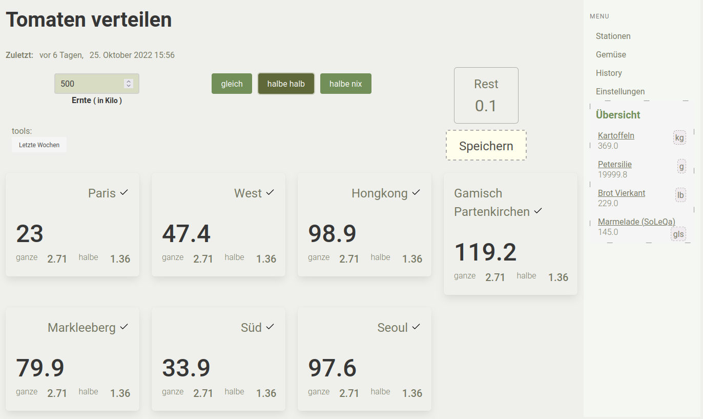
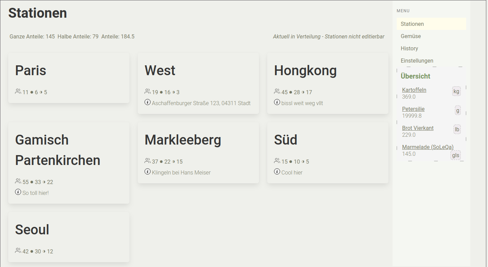
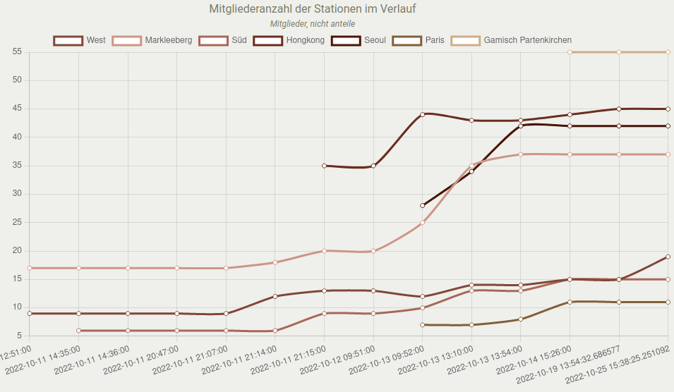

Willkommen zur __Möhrenschleuder__([github](https://github.com/iameru/mschleuder)), ein Tool für _nicht nur_ [CSA's / SoLaWis](https://www.solidarische-landwirtschaft.org/startseite) / Kollektivbetriebe die ihre __Erzeugnisse__:

 - an all ihre Mitglieder verteilen
 - an verschiedene Stationen/Lieferorte
 - mit halben und ganzen Anteilen

_Bilder sagen mehr als Tausend Worte:_

check out my [github](https://github.com/iameru)
